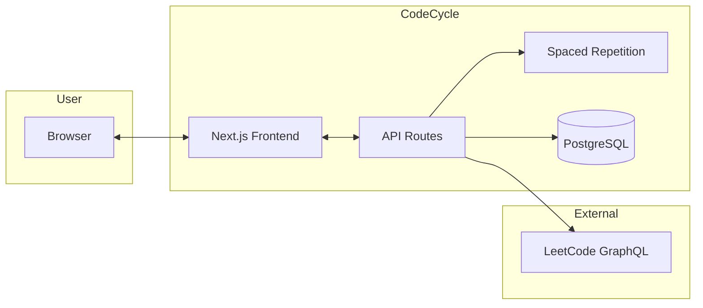
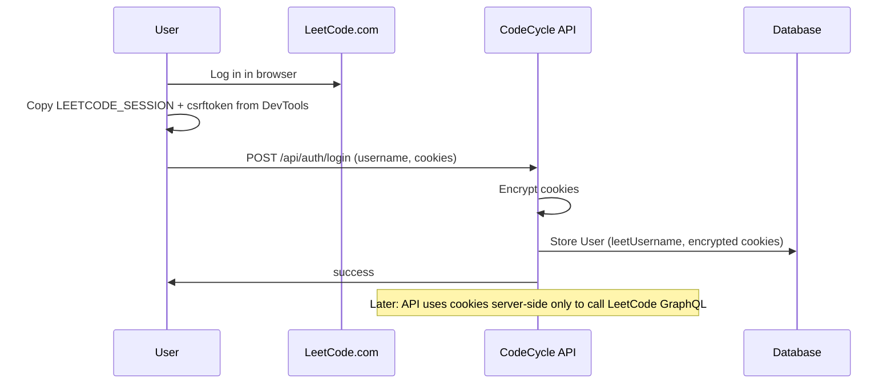
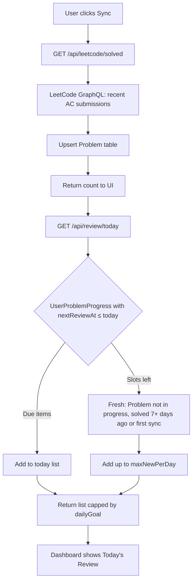
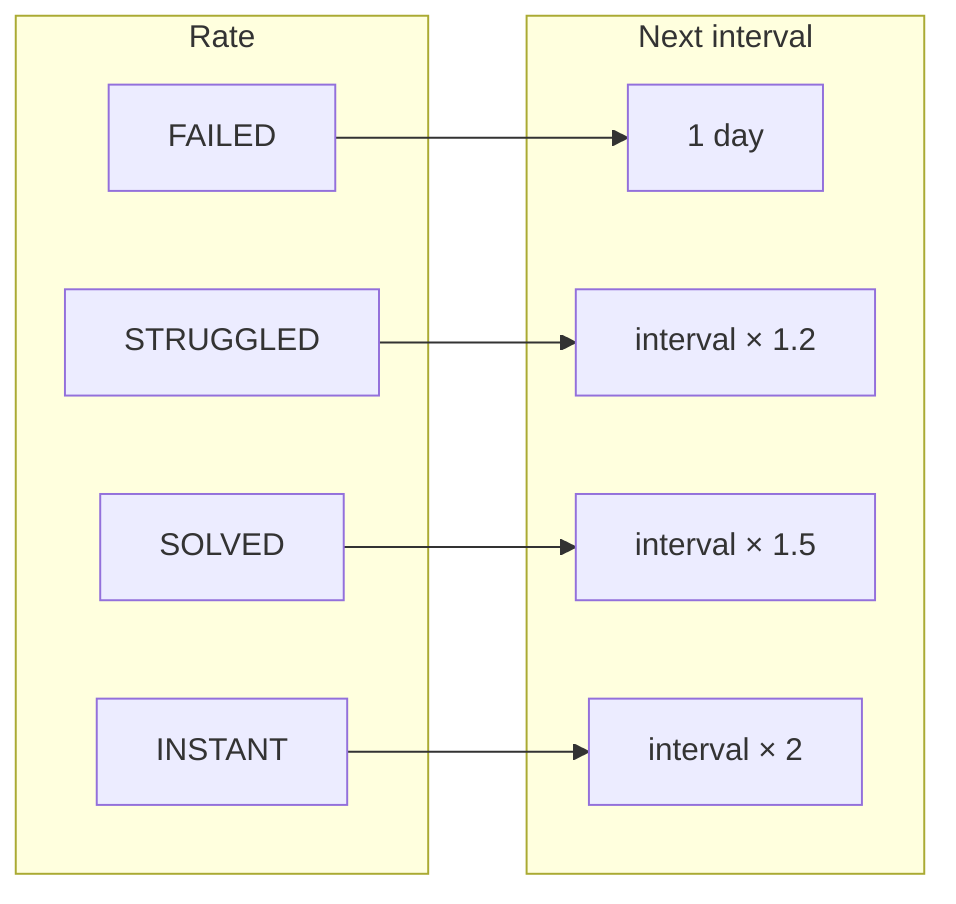
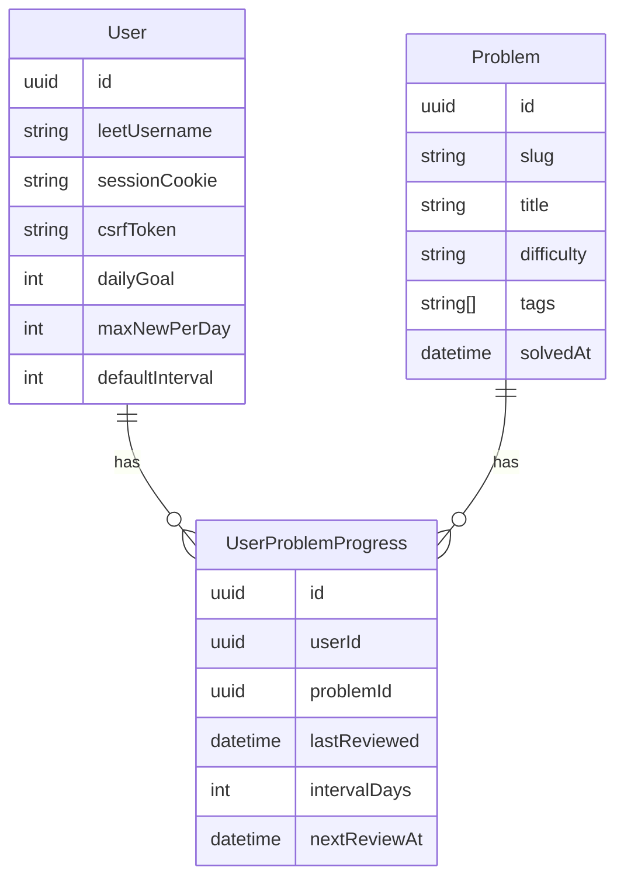

# CodeCycle

**Anki for LeetCode** — spaced repetition for coding problems.

CodeCycle syncs your solved LeetCode problems and builds a daily review queue using a spaced repetition algorithm. You see problems again at optimal intervals (like Anki flashcards) so patterns stick instead of fading after a few weeks.

---

## Summary

| | Anki | CodeCycle |
|---|------|-----------|
| **Content** | Flashcards | LeetCode problems you’ve solved |
| **Schedule** | Spaced repetition (again, good, easy) | Spaced repetition (failed, struggled, solved, instant) |
| **Source** | You create cards | Synced from your LeetCode account |
| **Goal** | Long-term retention of facts | Long-term retention of patterns & interview readiness |

- **Login:** You paste LeetCode session cookies (no official OAuth). The app stores them encrypted and never sends them to the client.
- **Sync:** Fetches your solved problems via LeetCode’s GraphQL API and stores them in PostgreSQL.
- **Today’s list:** Built from (1) problems due for review (`nextReviewAt ≤ today`) and (2) “fresh” problems (never reviewed, up to your daily goal).
- **Review:** You open the problem on LeetCode, solve or recall, then rate: **Failed** → **Struggled** → **Solved** → **Instant**. The app computes the next review date and saves progress.
- **Settings:** Daily goal, max new per day, and default interval (e.g. 7 days before a synced problem can enter the queue).

---

## How It Works (System Overview)

### High-level architecture



- **Frontend:** Next.js (App Router), React, TypeScript, Tailwind. Pages: `/`, `/login`, `/dashboard`, `/review`, `/browse`.
- **Backend:** Next.js API routes. Auth (login/logout), LeetCode proxy (profile, solved), review (today, submit, settings).
- **Data:** PostgreSQL + Prisma. Models: `User`, `Problem`, `UserProblemProgress` (one row per user–problem with `nextReviewAt`, `intervalDays`, etc.).

### Authentication flow (cookie-based)

LeetCode has no public OAuth, so the app uses session cookies.



### Sync and daily list flow



### Spaced repetition (review outcome → next interval)

After you rate a problem, the next review date is computed and stored.



Formula: `nextReviewAt = today + newIntervalDays`. First review uses a default interval (e.g. 7 days) when the problem enters the queue.

### Data model (conceptual)



---

## Draw.io diagrams

Editable diagrams (open in [draw.io](https://app.diagrams.net/) or VS Code with Draw.io extension):

| Diagram | File | Description |
|--------|------|-------------|
| System architecture | [docs/diagrams/architecture.drawio](docs/diagrams/architecture.drawio) | Components and data flow |
| Auth & sync flow | [docs/diagrams/auth-and-sync.drawio](docs/diagrams/auth-and-sync.drawio) | Login and LeetCode sync |
| Review & scheduling | [docs/diagrams/review-scheduling.drawio](docs/diagrams/review-scheduling.drawio) | Daily list and spaced repetition |

---

## Tech stack

- **App:** Next.js 16 (App Router), React, TypeScript, Tailwind CSS
- **API:** Next.js API routes, server-side LeetCode GraphQL proxy
- **Data:** Prisma, PostgreSQL (e.g. Neon / Supabase)
- **Deploy:** Vercel + hosted Postgres

---

## Getting started

1. **Clone and install**

   ```bash
   git clone <repo-url>
   cd CodeCycle
   npm install
   ```

2. **Database**

   ```bash
   cp .env.example .env
   # Set DATABASE_URL and DIRECT_URL (PostgreSQL)
   npx prisma migrate dev
   ```

3. **Run**

   ```bash
   npm run dev
   ```

   Open [http://localhost:3000](http://localhost:3000). Log in with your LeetCode username and session cookies (from browser DevTools after logging into LeetCode), then sync and use Today’s Review.

---

## Scripts

| Command | Purpose |
|--------|---------|
| `npm run dev` | Start Next.js dev server |
| `npm run build` | Production build |
| `npm run start` | Run production server |
| `npx prisma migrate dev` | Apply migrations |
| `npx prisma studio` | Open Prisma Studio |

---

## Security notes

- Session and CSRF cookies are stored encrypted and used only on the server.
- All LeetCode requests go through your backend; cookies are never exposed to the client.
- Use HTTPS in production and rotate cookies if you suspect compromise.

---

For full product and technical details, see [PRD.md](PRD.md).
