# CodeCycle

**Anki for LeetCode** — spaced repetition for coding problems.

CodeCycle syncs your solved LeetCode problems and builds a daily review queue using a spaced repetition algorithm. You see problems again at optimal intervals (like Anki flashcards) so patterns stick instead of fading after a few weeks.

---


## Summary

| | Anki | CodeCycle |
|---|------|-----------|
| **Content** | Flashcards | LeetCode problems you’ve solved |
| **Schedule** | Spaced repetition (again, good, easy) | Spaced repetition (failed, struggled, solved, instant) |
| **Source** | You create cards | Synced from your LeetCode account |
| **Goal** | Long-term retention of facts | Long-term retention of patterns & interview readiness |

- **Login:** You paste LeetCode session cookies (no official OAuth). The app stores them encrypted and never sends them to the client.
- **Sync:** Fetches your solved problems via LeetCode’s GraphQL API and stores them in PostgreSQL.
- **Today’s list:** Built from (1) problems due for review (`nextReviewAt ≤ today`) and (2) “fresh” problems (never reviewed, up to your daily goal).
- **Review:** You open the problem on LeetCode, solve or recall, then rate: **Failed** → **Struggled** → **Solved** → **Instant**. The app computes the next review date and saves progress.
- **Settings:** Daily goal, max new per day, and default interval (e.g. 7 days before a synced problem can enter the queue).

---

## How It Works (System Overview)

### High-level architecture


- **Frontend:** Next.js (App Router), React, TypeScript, Tailwind. Pages: `/`, `/login`, `/dashboard`, `/review`, `/browse`.
- **Backend:** Next.js API routes. Auth (login/logout), LeetCode proxy (profile, solved), review (today, submit, settings).
- **Data:** PostgreSQL + Prisma. Models: `User`, `Problem`, `UserProblemProgress` (one row per user–problem with `nextReviewAt`, `intervalDays`, etc.).

### Authentication flow (cookie-based)

LeetCode has no public OAuth, so the app uses session cookies.


### Spaced repetition (review outcome → next interval)

After you rate a problem, the next review date is computed and stored.

```mermaid
flowchart LR
    subgraph Rate
        R1[FAILED]
        R2[STRUGGLED]
        R3[SOLVED]
        R4[INSTANT]
    end
    subgraph Next interval
        N1[1 day]
        N2[interval × 1.2]
        N3[interval × 1.5]
        N4[interval × 2]
    end
    R1 --> N1
    R2 --> N2
    R3 --> N3
    R4 --> N4
```



Formula: `nextReviewAt = today + newIntervalDays`. First review uses a default interval (e.g. 7 days) when the problem enters the queue.

### Data model (conceptual)


---

## Tech stack

- **App:** Next.js 16 (App Router), React, TypeScript, Tailwind CSS, shadcn/ui
- **API:** Next.js API routes, server-side LeetCode GraphQL proxy
- **Data:** Prisma, PostgreSQL (Supabase)
- **Extension:** Chrome Manifest V3, vanilla JS
- **Deploy:** Vercel + hosted Postgres

---

## Getting started

1. **Clone and install**

   ```bash
   git clone <repo-url>
   cd CodeCycle
   npm install
   ```

2. **Database**

   ```bash
   cp .env.example .env
   # Set DATABASE_URL and DIRECT_URL (PostgreSQL)
   npx prisma migrate dev
   ```

3. **Run**

   ```bash
   npm run dev
   ```

   Open [http://localhost:3000](http://localhost:3000). Log in with your LeetCode username and session cookies (from browser DevTools after logging into LeetCode), then sync and use Today's Review.

---

## Chrome Extension

The Chrome extension provides a quick way to review problems without opening the full dashboard.

### Installation

1. Open Chrome and go to `chrome://extensions/`
2. Enable **Developer mode** (toggle in top right)
3. Click **Load unpacked**
4. Select the `extension` folder from this project

### Usage

1. **Log into LeetCode** in your browser first (the extension reads your session cookies)
2. Click the **CodeCycle** extension icon in Chrome toolbar
3. Enter your **LeetCode username** and click **Connect LeetCode**
4. Click **Sync from LeetCode** to import your solved problems
5. Review problems directly in the popup:
   - Click **Open on LeetCode** to solve the problem
   - Rate yourself: Failed / Struggled / Solved / Instant
   - Next problem appears automatically
6. Click **Dashboard →** link to open the full web app

### Features

- **One-click auth**: No manual cookie copying - reads from your browser
- **Quick reviews**: Rate problems without leaving your current tab
- **Progress tracking**: See how many problems you've completed today
- **Sync button**: Pull latest solved problems from LeetCode
- **Japandi design**: Clean, minimal interface with sage green accents

### Extension Files

```
extension/
├── manifest.json    # Chrome extension config (Manifest V3)
├── background.js    # Service worker for API calls
├── popup.html       # Extension popup UI
├── popup.css        # Japandi theme styling
└── popup.js         # Popup logic
```

### Development

After making changes to extension files:
1. Go to `chrome://extensions/`
2. Click the refresh icon (🔄) on CodeCycle
3. Click the extension to see changes

---

## Scripts

| Command | Purpose |
|--------|---------|
| `npm run dev` | Start Next.js dev server |
| `npm run build` | Production build |
| `npm run start` | Run production server |
| `npx prisma migrate dev` | Apply migrations |
| `npx prisma studio` | Open Prisma Studio |

---

## Security notes

- Session and CSRF cookies are stored encrypted and used only on the server.
- All LeetCode requests go through your backend; cookies are never exposed to the client.
- Use HTTPS in production and rotate cookies if you suspect compromise.

---

